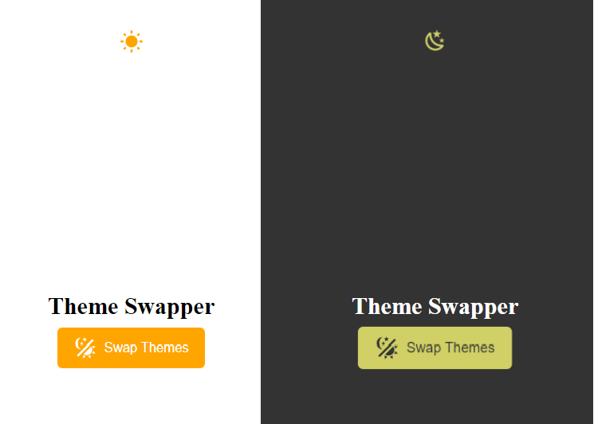

## 2022-12-09

I am interested in different darkMode coding. I set darkMode using tailwindcss in other repo 'ReactFirebase-FullStackProject-bookLibrary'. I tried a basic way this time. Just for fun.

### Technologies I used for darkMode

1. HTML
2. CSS
3. JavaScript
4. SVG file

### Why called it advanced darkMode

1. More practiced varibles using in CSS
2. More practiced `transform` and `transition` in CSS
3. Animation about sun and moon 180 degree moving when button clicked. I coded in script.js instead of coding in CSS
   `sunMoonContainer.style.setProperty("--rotation", currentRotation + 180);`

